# Ai-hunter v1.0
* This project is aiming to show our result of Talent Mining in the patent field of Artificial Intelligence.


## Datasets
* Download the dataset.zip and extract it into the project root.

dataset.zip is available at https://drive.google.com/open?id=1W0aPEHzdVNazboIIROOudTF57eGOzRvZ


## Requirements
* Windows10 Home or Ubuntu
* Python 3.7
* Pandas 0.24.1
* Flask 1.0.2


## Usage
**Win:**
Run the prod.bat.

**Linux:**

```
flask run --host=0.0.0.0
```

*******

## Acknowledge

This work is supported by  National Undergraduate Training Programs for Innovation and Entrepreneurship(No.2018101410701010026).

## Slides


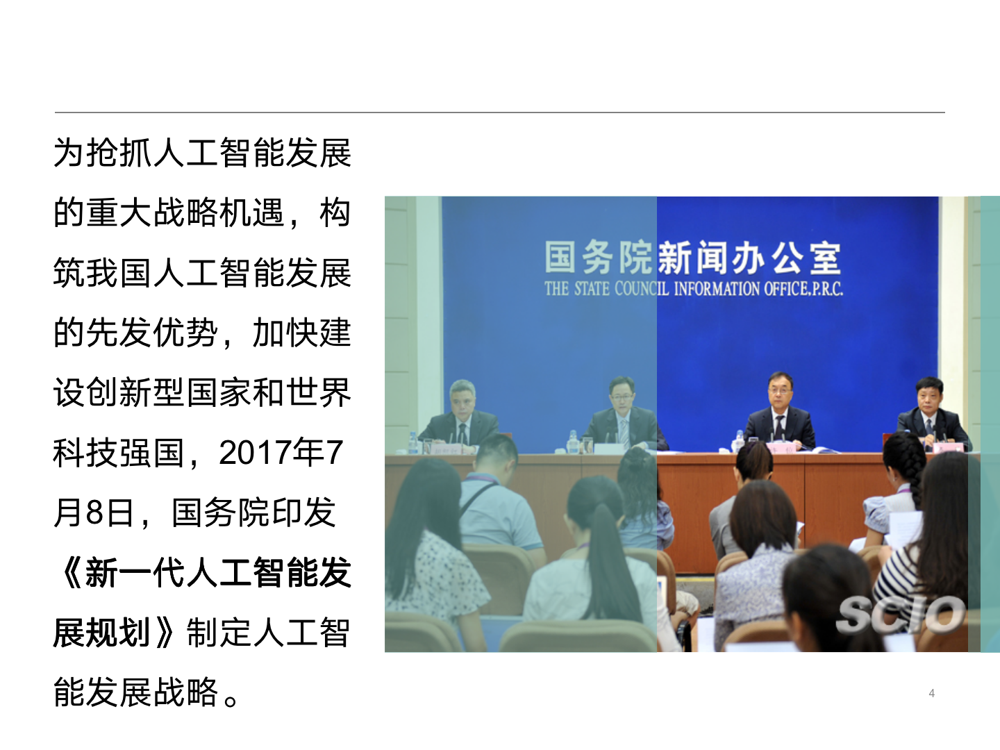

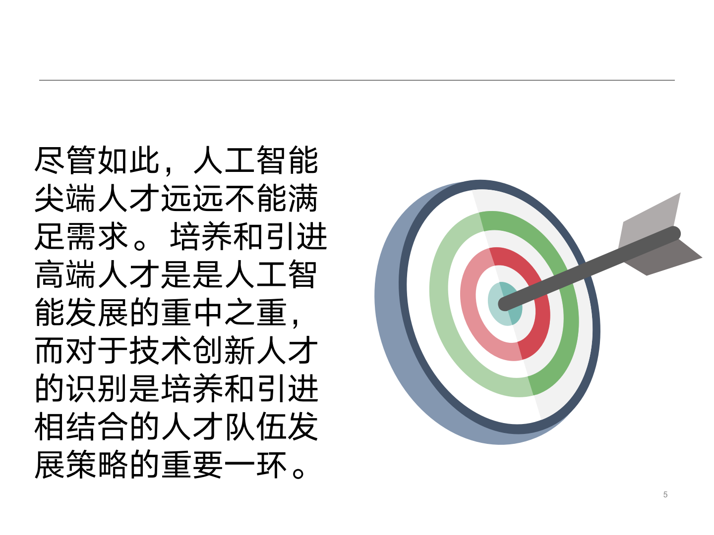


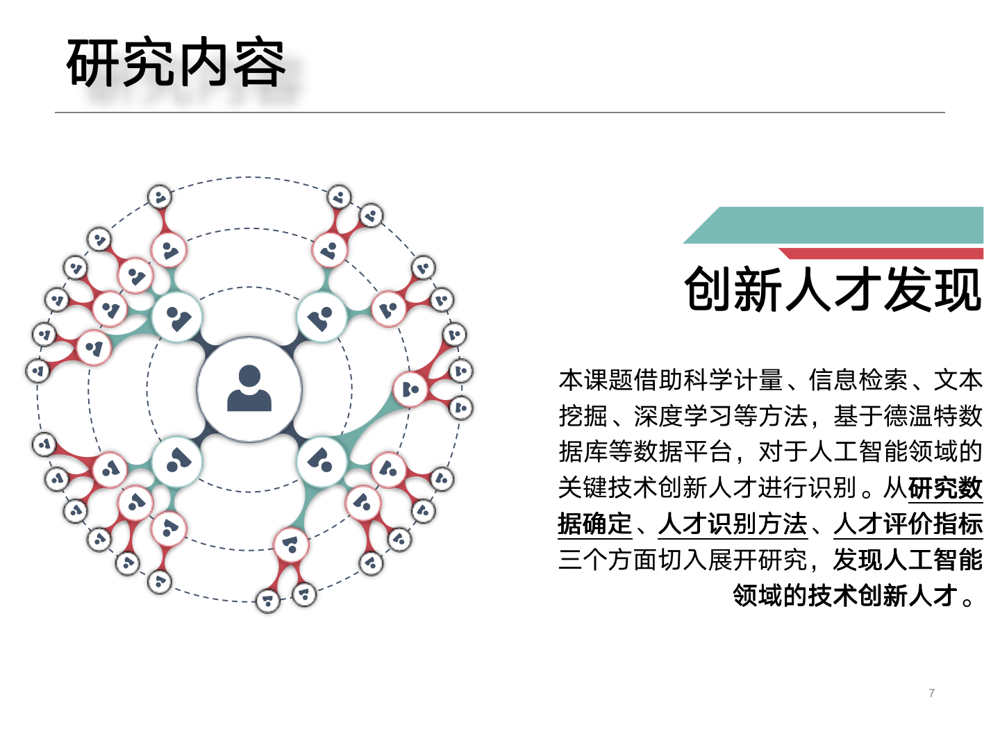

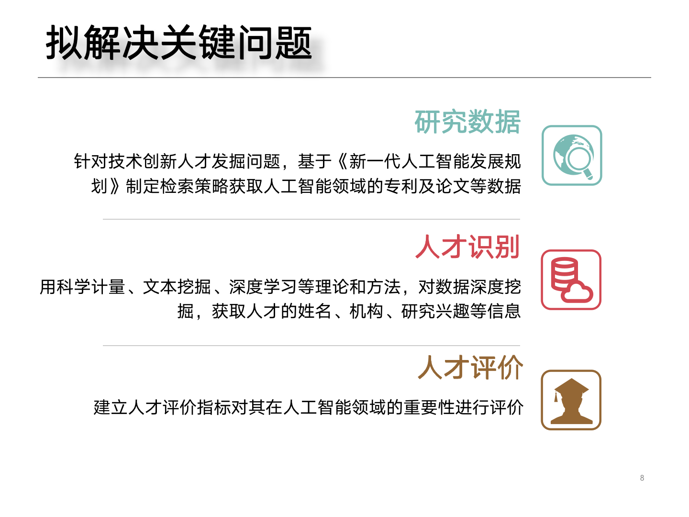


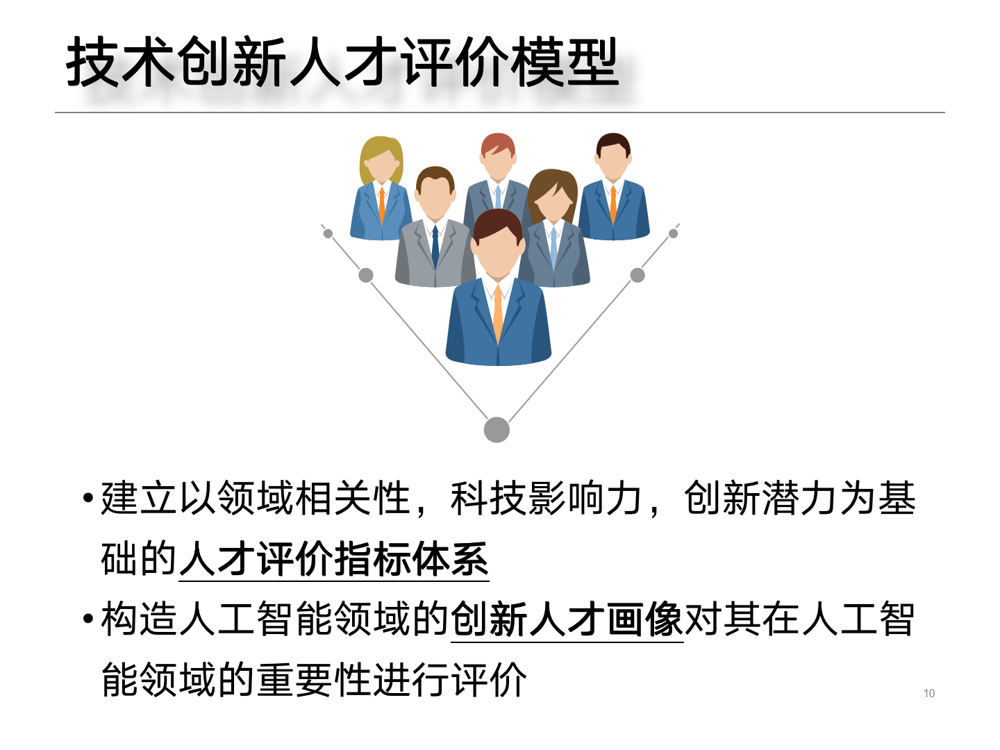

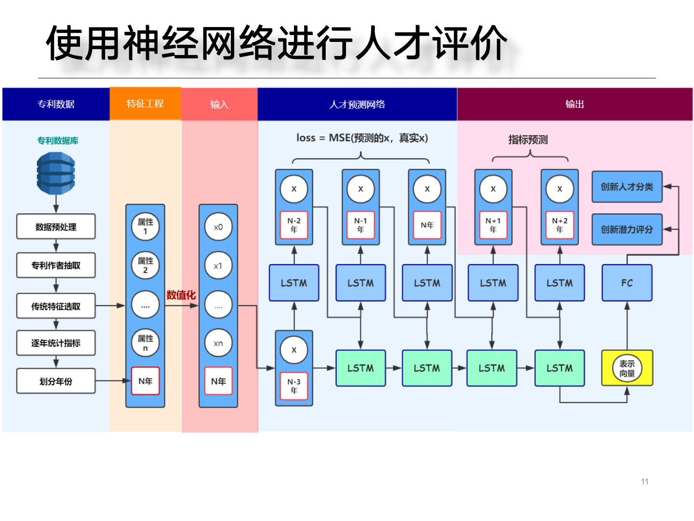


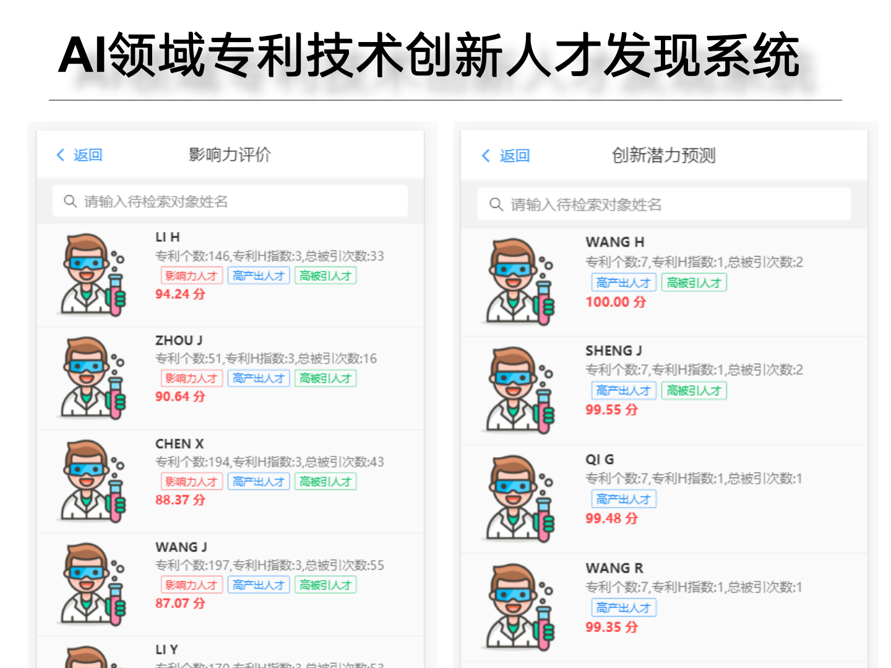

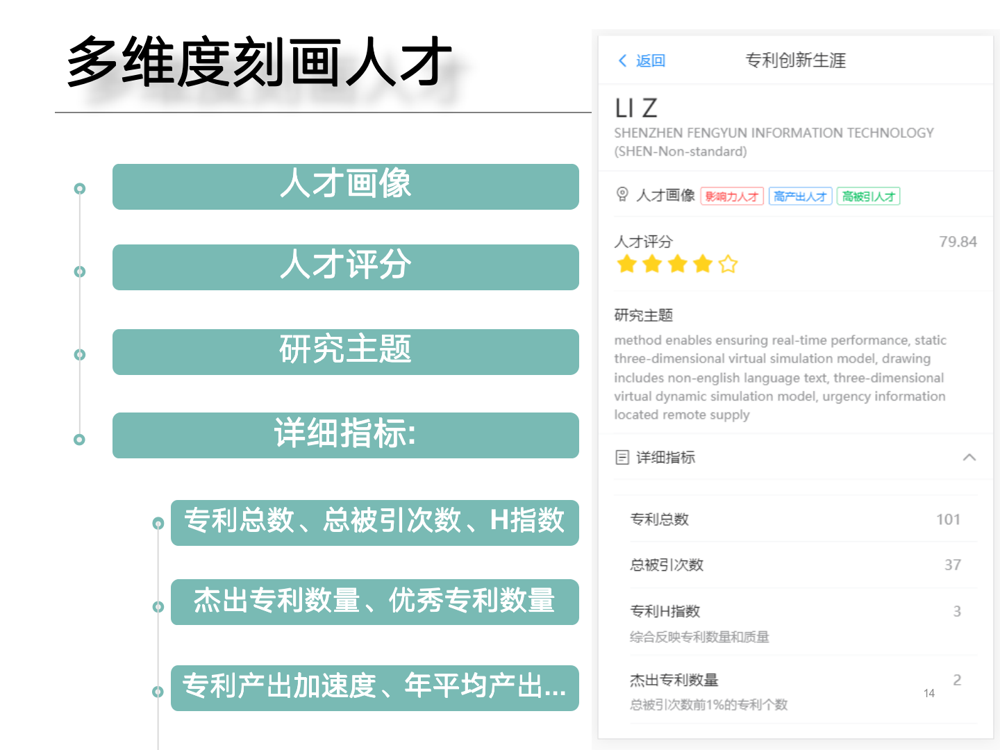

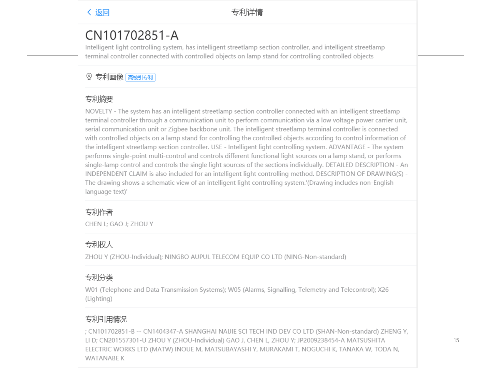


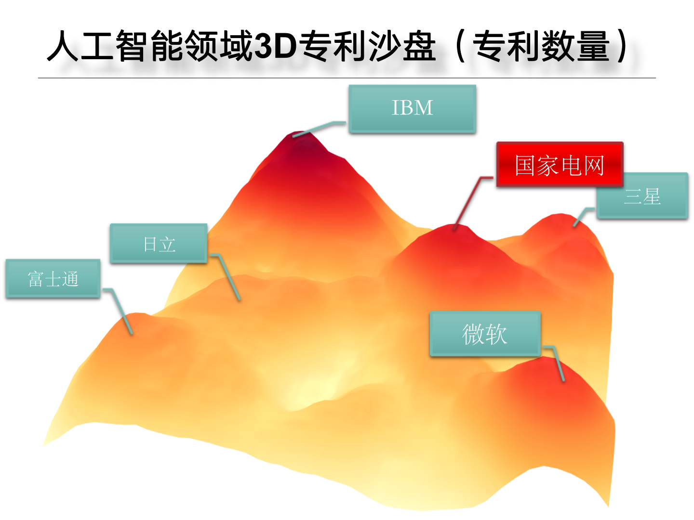

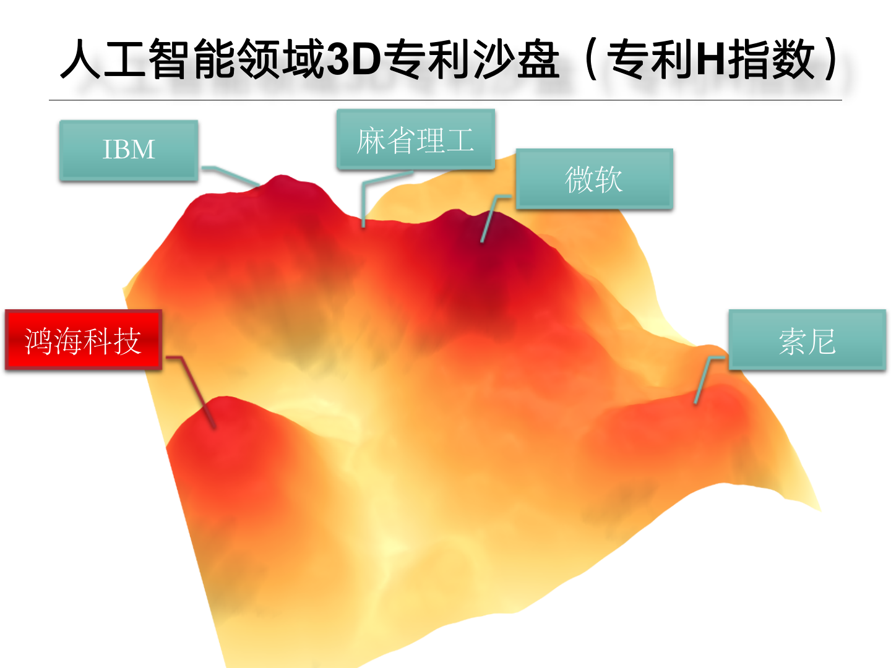

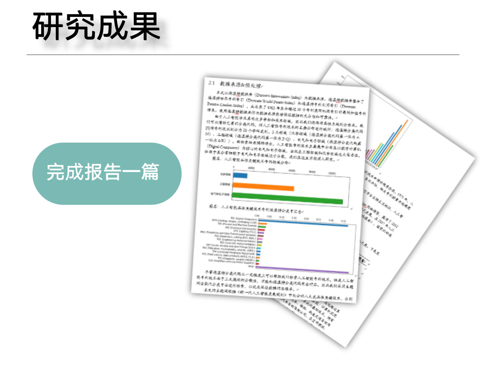


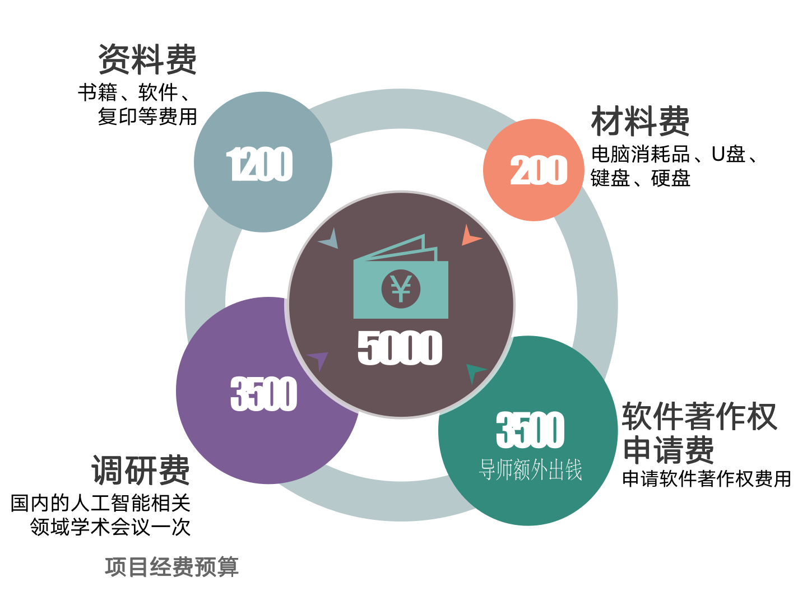

